# 📱 iOS Apps Portfolio

Welcome to my portfolio repository!  
Here you'll find a collection of my iOS applications, each with a short description and screenshots to showcase my work.  
All apps are designed and developed by me, with a focus on clean UI, smooth UX, and modern technologies.

---

## 🔹 What's Inside?
- 📸 Multiple iOS app projects
- 🖼 High-quality screenshots for each project
- ✏️ Short descriptions of functionality and purpose

---

## Skinly
An innovative iOS app developed as a master's thesis project. It uses artificial intelligence to analyze skin photos and provide preliminary assessments of potential dermatological conditions

  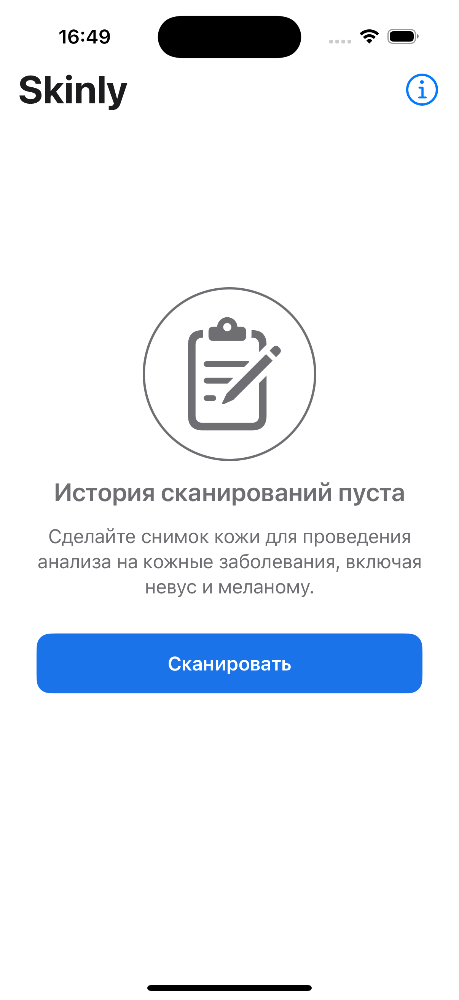
  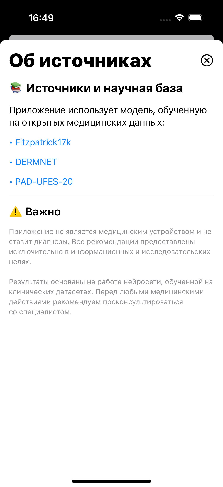

  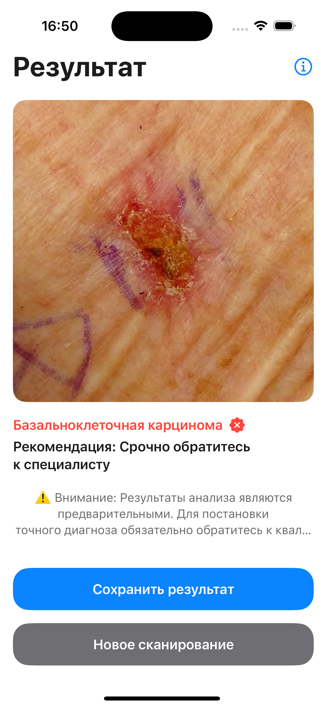
  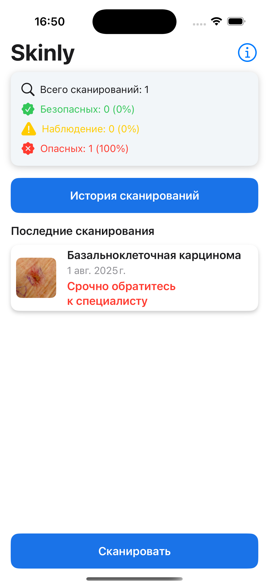

---

## 🌿 Plant Care App
An AI-powered plant care assistant that analyzes plant photos, detects issues, and generates care recommendations.

**Key features:**
- 🌱 Plant health detection via AI  
- 📋 Personalized care instructions  
- ⏰ Automatic task scheduling for watering, fertilizing, and more  

  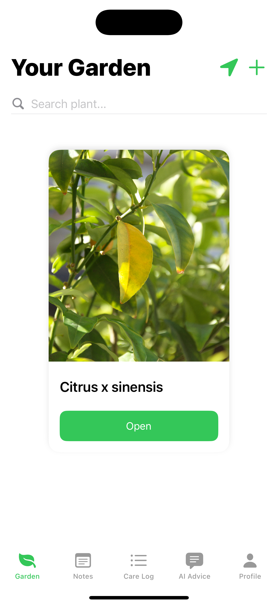
  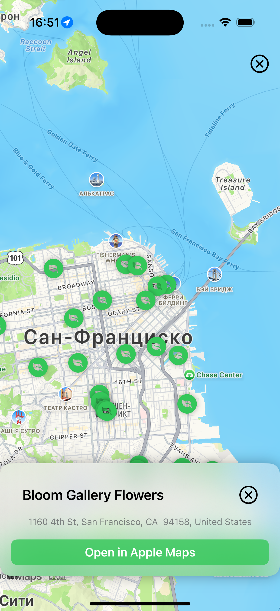
  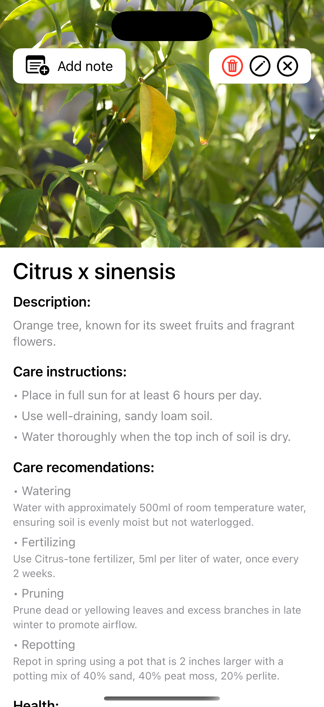

  
  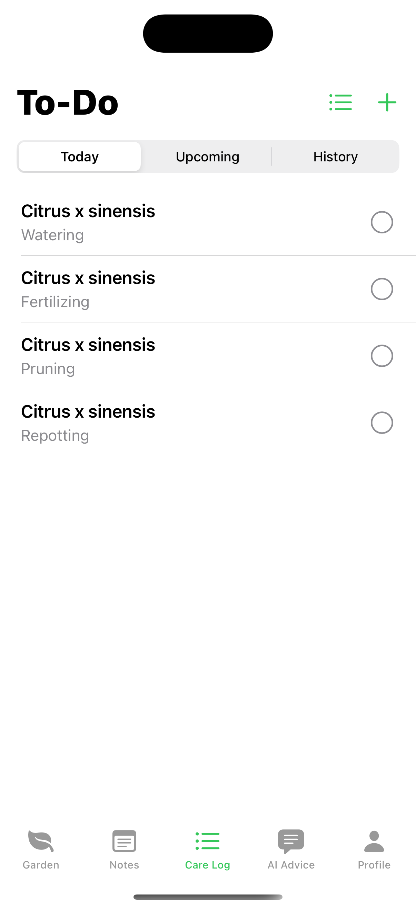
  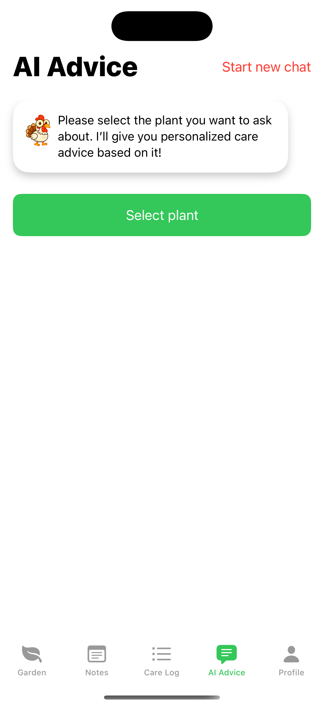

---

## 🐣 Chicken Roller
A mobile game where user has to bring the egg to the pot

  
  
  

---

## 🍏 Fruit Spinner
A mobile game where user has to control ball and destroy fruits

  
  
  

  
  

---

## 🧑‍🍳 Noodles
A mobile app that allows the user to add recipes himself, as well as generate them using ChatGpt, sending only what is in the refrigerator

  
  

  
  

---

## Shade Shift
A mobile game where the user needs to launch a ball to collect coins

  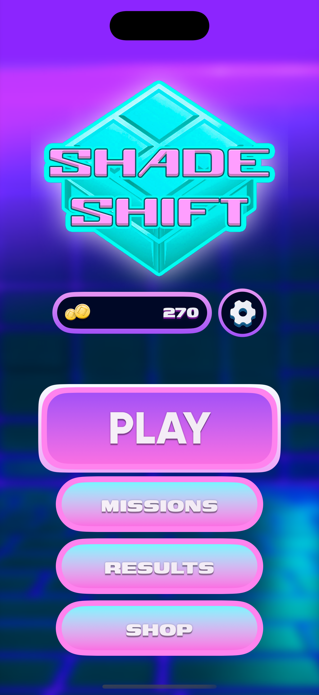
  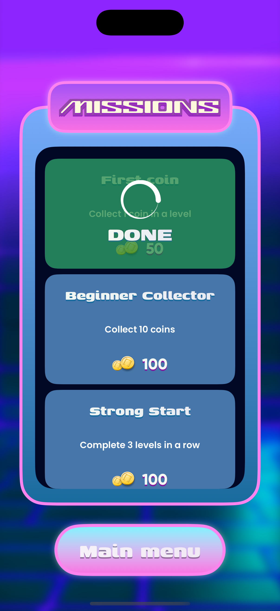

  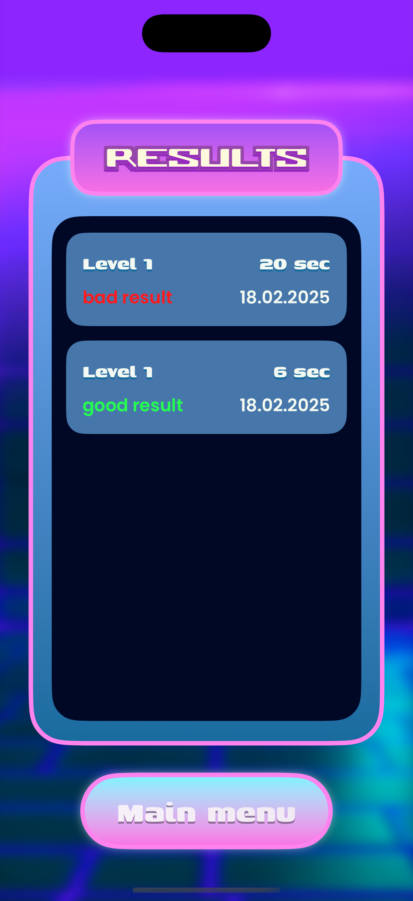
  

---

## Workout Bounce
A mobile fitness app that helps users track their fitness progress by assigning exercises determined through a plinko-style mechanic

  
  
  
  

  
  
  
  

  

---

## 📜 License
All screenshots and visuals in this repository are the property of the author.  
Reuse, distribution, or modification is **not allowed** without explicit permission.

---
